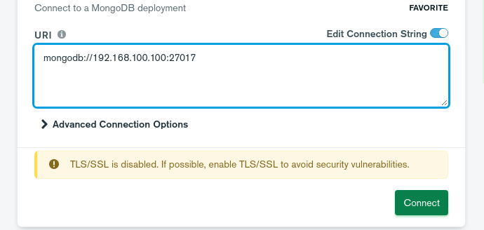
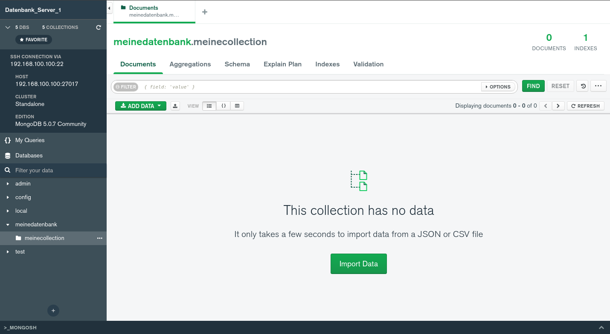

# MongoDB

## Recherche

### Vorteile SQL

- Optimierungen im Bereich Speicherplatz bedarf
- Garantiere korrekte Transaktionen
- Verschiedenste Verwendungszwecke

### Nachteile SQL

- Limitiere horizontale Skalierbarkeit
- Nur durch Replikation und Failover gesichert, keine mehreren Nodes
- Schema Änderungen bedeuten Downtime

### Vorteile NoSQL

- Skalierbar und hochverfügbar
- Schemas sind dynamisch, können stets verändert werden
- Schemas für unstrukturierte Daten
- Hohe Performance
- High-level APIs

### Nachteile NoSQL

- ACID ist nicht komplett richtig implementiert
- Generelle Probleme welche mit verteilten Systemen auftreten
- Keine Abstraktion bedeutet kaum Optimierung für NoSQL Engines

### Anwendung MongoDB

- Big Data
- Analytics
- Online Stores
- CMS
- Mobile-Apps -> Dynamisches scaling
- Real-time Daten

### Kunden

- Ebay
- Google
- Forbes
- Toyota
- OTTO
- Bosch
- SEGA
- Verizon
- EA
- Cisco
- Adobe

### Entwickler / Hersteller / Produktinformationen

Hersteller: MongoDB Inc.
Erster Release: 11. Feb 2009
Sprachen: C++, JS, Python
Unterstützt: Windows, Linux MacOS
Lizenz: Server Side Public License (Modifizierte AGPL V3 Copyleft Lizenz)

## Voraussetzungen der Installation

MongoDB gibt einige Dinge an, welche vor der Installation beachtet werden müssen / sollten oder empfohlen sind.

- Ubuntu LTS Versionen 16.04, 18.04 oder 20.04 (Falls man Ubuntu Server verwendet)
- 64bit System
- Internet Zugang
- 10GB freier Speicher + Speicher für eigene DBs
- 4GB RAM
- APT Paket von ihrem Repository für offiziellen support

## Prozess der Installation

Zur Installation habe ich die [offizielle Anleitung](https://www.mongodb.com/docs/manual/tutorial/install-mongodb-on-ubuntu/) verwendet.  

Als erstes müssen wir den Public Key von ihrem Repo unserem System hinzufügen:

```bash
wget -qO - https://www.mongodb.org/static/pgp/server-5.0.asc | sudo apt-key add -
```

Anschliessend müssen wir das Repo unter ```/etc/apt/sources.list.d``` hinzufügen, damit apt auch weiss, woher wir die Pakete nun beziehen können. Ich habe mich dazu entschlossen, ihr offizielles Paket zu verwenden. 

```bash
echo "deb [ arch=amd64,arm64 ] https://repo.mongodb.org/apt/ubuntu focal/mongodb-org/5.0 multiverse" | sudo tee /etc/apt/sources.list.d/mongodb-org-5.0.list
```

!> Das "focal" muss immer der richtigen Ubuntu Version angepasst werden, 20.04 ist in diesem Fall "focal", 18.04 wäre "bionic" und 16.04 ist "xenial"

Abschliessend können wir die Paketliste nun aktualisieren und MongoDB anschliessend installieren:

```bash
sudo apt-get update && sudo apt-get install -y mongodb-org
```

Dies sollte zu folgendem Output führen:

```bash
The following additional packages will be installed:
The following NEW packages will be installed:
  mongodb-database-tools mongodb-mongosh mongodb-org mongodb-org-database mongodb-org-database-tools-extra
  mongodb-org-mongos mongodb-org-server mongodb-org-shell mongodb-org-tools
0 upgraded, 9 newly installed, 0 to remove and 36 not upgraded.
Need to get 147 MB of archives.
After this operation, 464 MB of additional disk space will be used.
Get:1 https://repo.mongodb.org/apt/ubuntu focal/mongodb-org/5.0/multiverse amd64 mongodb-database-tools amd64 100.5.2 [46.5 MB]
Get:2 https://repo.mongodb.org/apt/ubuntu focal/mongodb-org/5.0/multiverse amd64 mongodb-mongosh amd64 1.3.1 [40.8 MB]
Get:3 https://repo.mongodb.org/apt/ubuntu focal/mongodb-org/5.0/multiverse amd64 mongodb-org-shell amd64 5.0.7 [14.4 MB]
Get:4 https://repo.mongodb.org/apt/ubuntu focal/mongodb-org/5.0/multiverse amd64 mongodb-org-server amd64 5.0.7 [26.3 MB]
Get:5 https://repo.mongodb.org/apt/ubuntu focal/mongodb-org/5.0/multiverse amd64 mongodb-org-mongos amd64 5.0.7 [18.5 MB]
Get:6 https://repo.mongodb.org/apt/ubuntu focal/mongodb-org/5.0/multiverse amd64 mongodb-org-database-tools-extra amd64 5.0.7 [7,752 B]
Get:7 https://repo.mongodb.org/apt/ubuntu focal/mongodb-org/5.0/multiverse amd64 mongodb-org-database amd64 5.0.7 [3,540 B]
Get:8 https://repo.mongodb.org/apt/ubuntu focal/mongodb-org/5.0/multiverse amd64 mongodb-org-tools amd64 5.0.7 [2,892 B]
Get:9 https://repo.mongodb.org/apt/ubuntu focal/mongodb-org/5.0/multiverse amd64 mongodb-org amd64 5.0.7 [2,932 B] 
```

Hier sehen wir deutlich, welche Pakete wir alle installieren und welche Version davon. In diesem Fall sind wir auf der neusten Version, also 5. Das Repository ist wie erwünscht das offizielle von MongoDB "https://repo.mongodb.org/".

### Weiteres

Ressourcen-Optimierungen oder Änderungen am Systemd Startup File können hier vorgenommen werden:

```bash
/lib/systemd/system/mongod.service
```

Möchte man meinen ganzen Installationsprozess verfolgen, so kann man diesen [hier](../other/mongodb_installation.md) finden.

## Test der Installation

Hier ein paar Grundlegende Dinge welche direkt nach der Installation erledigt werden sollten um sicher zu stellen, dass alles ordnungsgemäss funktioniert:

Als erstes möchten wir den Service in den Autostart hinzufügen und ihn auch starten:

```bash
sudo systemctl enable --now mongod

# Output
Created symlink /etc/systemd/system/multi-user.target.wants/mongod.service → /lib/systemd/system/mongod.service.
```

Nun überprüfen wir ob er auch gestartet wurde:

```bash
systemctl status mongod

# Output
● mongod.service - MongoDB Database Server
     Loaded: loaded (/lib/systemd/system/mongod.service; disabled; vendor preset: enabled)
     Active: active (running) since Thu 2022-04-21 06:46:20 UTC; 3s ago
       Docs: https://docs.mongodb.org/manual
   Main PID: 2677 (mongod)
     Memory: 65.4M
     CGroup: /system.slice/mongod.service
             └─2677 /usr/bin/mongod --config /etc/mongod.conf

Apr 21 06:46:20 datenbank systemd[1]: Started MongoDB Database Server.
```

Zuletzt überprüfen wir noch, ob wir auch die Mongo Shell öffnen können:

```bash
mongo --shell

# Output
MongoDB shell version v5.0.7
connecting to: mongodb://127.0.0.1:27017/?compressors=disabled&gssapiServiceName=mongodb
Implicit session: session { "id" : UUID("36c09630-a97a-4a90-b001-5ec9532f4c69") }
MongoDB server version: 5.0.7
type "help" for help
================
Warning: the "mongo" shell has been superseded by "mongosh",
which delivers improved usability and compatibility.The "mongo" shell has been deprecated and will be removed in
an upcoming release.
For installation instructions, see
https://docs.mongodb.com/mongodb-shell/install/
================
Welcome to the MongoDB shell.
For interactive help, type "help".
For more comprehensive documentation, see
	https://docs.mongodb.com/
Questions? Try the MongoDB Developer Community Forums
	https://community.mongodb.com
---
The server generated these startup warnings when booting: 
        2022-04-21T06:46:20.362+00:00: Using the XFS filesystem is strongly recommended with the WiredTiger storage engine. See http://dochub.mongodb.org/core/prodnotes-filesystem
        2022-04-21T06:46:21.400+00:00: Access control is not enabled for the database. Read and write access to data and configuration is unrestricted
---
---
        Enable MongoDB's free cloud-based monitoring service, which will then receive and display
        metrics about your deployment (disk utilization, CPU, operation statistics, etc).

        The monitoring data will be available on a MongoDB website with a unique URL accessible to you
        and anyone you share the URL with. MongoDB may use this information to make product
        improvements and to suggest MongoDB products and deployment options to you.

        To enable free monitoring, run the following command: db.enableFreeMonitoring()
        To permanently disable this reminder, run the following command: db.disableFreeMonitoring()
---
```

## Erste Schritte mit MongoDB

### Datenbank erstellen

Hier kann man direkt den "use" Befehl verwenden, existiert die DB nicht so wird sie direkt erstellt.

```js
> use meinedatenbank
switched to db meinedatenbank
```

### Collection erstellen

Hier haben wir nun eine Collection erstellt welche grössen-limitiert ist. Die "size" ist hierbei in Bytes und das "max" definiert die maximale Anzahl an Dokumenten welche in dieser Collection existieren darf. 

```js
> db.createCollection ("meinecollection", { capped: true,
...         size: 6142800,
...         max: 10000 } )
{ "ok" : 1 }
```

### Dokumente

#### Hinzufügen

Es gibt verschiedene Befehle um diese einzufügen:

```js
.insertOne()  <--- Ein Dokument einfügen
.insertMany()  <--- Mehrere Dokumente einfügen
.insert()  <--- Ein oder mehrere Dokumente einfügen
```

Wir fügen nun ein Dokument ein:

```js
db.meinecollection.insertOne(
{
    Name: "Name",
    Alter: 28,
    Geschlecht: "männlich"
}
)
```

#### Finden

Möchten wir dies wieder finden, also der Ersatz zu "SELECT" funktioniert dies wie folgt:

```js
db.meinecollection.find( { Name: "Name", Alter: 28 } )
```

#### Ändern

Natürlich gibt es auch den Ersatz für das UPDATE in SQL, wir verändern das Alter hier von 28 auf 30:

```js
db.meinecollection.update(

{ Alter: 28 },

{

$set: { Alter: 30 }

}

)
```

#### Löschen

Löschen funktioniert mittels dem "remove" Befehl, hier gibt es auch wieder verschiedene Versionen.

Alle Dokumente in der Collection löschen:

```js
db.meinecollection.remove ()
```

Dokumente löschen welche das Alter "28" beinhalten:

```js
db.meinecollection.remove ( { Alter: 28 } )
```

Das erste Dokument mit dem Alter "28" löschen:

```js
db.meinecollection.remove ( { Alter: 28 }, 1 )
```

### GUI 

### Vorbereitendes

Nach einer kurzen Recherche habe ich mich für MongoDB Compass entschieden, welches momentan noch in der Beta ist aber offiziell entwickelt wird.

Da kein GUI auf Ubuntu Server vorhanden ist, habe ich es lokal unter Fedora 36 installiert.

Folgende Anleitungen haben mich bei der Einrichtung und Installation unterstützt:

- https://www.digitalocean.com/community/tutorials/how-to-use-mongodb-compass

- https://www.digitalocean.com/community/tutorials/how-to-configure-remote-access-for-mongodb-on-ubuntu-20-04

### Installation

Die Installation ist unter Fedora relativ einfach:

```bash
# Wechseln in den Downloads Ordner

cd ~/Downloads

# Neuste Version vom Github (https://github.com/mongodb-js/compass/releases) herunterladen als RPM
wget https://github.com/mongodb-js/compass/releases/download/v1.31.3-beta.2/mongodb-compass-beta-1.31.3-beta.2.x86_64.rpm

# Anschliessend installieren

sudo dnf install ~/Downloads/mongodb-compass-beta-1.31.3-beta.2.x86_64.rpm -y
```

### Serverkonfiguration

Da ich die Applikation nicht lokal verwende, muss der Server noch so angepasst werden, dass der Zugriff von extern gestattet ist.

Hierfür das File ```/etc/mongod.conf``` editieren und unter "bindIp" die IP vom Server angeben nebst der lokalen Adresse:

```conf
# mongod.conf

# for documentation of all options, see:
#   http://docs.mongodb.org/manual/reference/configuration-options/

# Where and how to store data.
storage:
  dbPath: /var/lib/mongodb
  journal:
    enabled: true
#  engine:
#  wiredTiger:

# where to write logging data.
systemLog:
  destination: file
  logAppend: true
  path: /var/log/mongodb/mongod.log

# network interfaces
net:
  port: 27017
  bindIp: 127.0.0.1, 192.168.100.100 # Hier die Server IP hinzufügen


# how the process runs
processManagement:
  timeZoneInfo: /usr/share/zoneinfo
```

Damit die Änderungen aktiv werden müssen wir den Dienst noch einmal neustarten:

```bash
sudo systemctl restart mongod
```

### Erste Schritte

Um auf den Server zuzugreifen zu können, das Programm starten und anschliessend auf den Server mit IP und Port verbinden.



Sobald man verbunden ist, sieht es dann wie folgt etwa aus:

