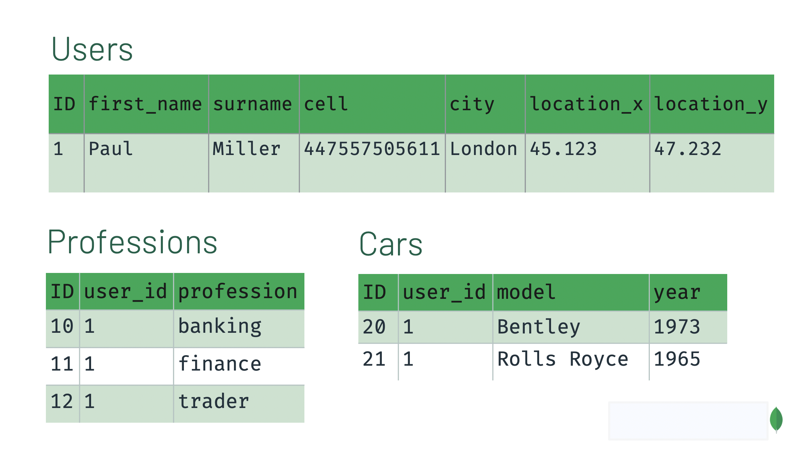

# Übungen Datenbankdesign, Indexierung, Performance, Sharding und Replication

<!-- tabs:start -->

## **Datenbankdesign MongoDB**

## Datenbankdesign MongoDB

Hier das wichtigste auf einen Blick:

- Embedded Dokumente sollten bevorzugt werden, ausser es gibt gute Gründe dagegen
- Falls es möglich sein sollte, ein Dokument einzeln anzeigen lassen zu können, so kann man sich dagegen entscheiden
- Joins oder Lookups sollten vermieden werden, ausser sie verbessern das Schema. So kann man gleich mit Referenzen arbeiten.
- Nested Arrays nicht unendlich gross laufen lassen
- Für Many-to-Many muss mit Referenzen gearbeitet werden
- Dokumente auf Grössen limitieren

Folgende Abbildung werden wir hier einmal Embedded erstellen aber auch mit Referencing:



### Embedding:

Die Umsetzung via Embedding könnte so aussehen:

```js
{
    "first_name": "Paul",
    "surname": "Miller",
    "cell": "447557505611",
    "city": "London",
    "location": [45.123, 47.232],
    "profession": ["banking", "finance", "trader"],
    "cars": [
        {
            "model": "Bentley",
            "year": 1973
        },
        {
            "model": "Rolls Royce",
            "year": 1965
        }
    ]
}
```

Man sieht, alles ist in einem Dokument.

### Referencing

Mit Referencing wird das ganze schwieriger, hier arbeiten wir mit zwei Collections:

Collection orders:

```js
db.orders.insertMany( [
   { "_id" : 1, "item" : "almonds", "price" : 12, "quantity" : 2 },
   { "_id" : 2, "item" : "pecans", "price" : 20, "quantity" : 1 },
   { "_id" : 3  }
] )
```

Collection inventory:

```js
db.inventory.insertMany( [
   { "_id" : 1, "sku" : "almonds", "description": "product 1", "instock" : 120 },
   { "_id" : 2, "sku" : "bread", "description": "product 2", "instock" : 80 },
   { "_id" : 3, "sku" : "cashews", "description": "product 3", "instock" : 60 },
   { "_id" : 4, "sku" : "pecans", "description": "product 4", "instock" : 70 },
   { "_id" : 5, "sku": null, "description": "Incomplete" },
   { "_id" : 6 }
] )
```

Mittels Lookup können wir nun die beiden Collections referenzieren:

```js
db.orders.aggregate( [
   {
     $lookup:
       {
         from: "inventory",
         localField: "item",
         foreignField: "sku",
         as: "inventory_docs"
       }
  }
] )
```

Ergibt folgenden Output:

```js
{
   "_id" : 1,
   "item" : "almonds",
   "price" : 12,
   "quantity" : 2,
   "inventory_docs" : [
      { "_id" : 1, "sku" : "almonds", "description" : "product 1", "instock" : 120 }
   ]
}
{
   "_id" : 2,
   "item" : "pecans",
   "price" : 20,
   "quantity" : 1,
   "inventory_docs" : [
      { "_id" : 4, "sku" : "pecans", "description" : "product 4", "instock" : 70 }
   ]
}
{
   "_id" : 3,
   "inventory_docs" : [
      { "_id" : 5, "sku" : null, "description" : "Incomplete" },
      { "_id" : 6 }
   ]
}
```

### Fazit

#### Vorteile von $lookup:

- Kleinere Dokumente
- Dokumente können kleiner als 16MB sein (limit)
- Wenn die referenzierten Daten nicht oft geladen werden, kann dies ein Vorteil sein
- Die Redundanzen in den Daten werden reduziert

#### Nachteile:

- Abfragen werden viel komplizierter

#### Vorteile von Embedding

- In einer Query sind alle Daten geladen
- Keine joins / lookups / referencing
- ALLE CRUD Operationen in einem Dokument sind ACID-Kompatibel

#### Nachteile

- Grosse Querys können bei vielen doppelten Daten zu grossem Overhead und somit Performance Reduktion führen.

## **Indexierung und Performance**

## Indexierung und Performance

### Auftrag 1

In MongoDB können wir Javascript Funktionen importieren und verwenden. Dies können wir uns zu nutze machen um random Daten zu generieren, daher importieren wir folgende Funktion in unsere MongoDB Instanz:

```js
    populatePhones = function(area, start, stop) {
      for(var i = start; i < stop; i++) {
        var country = 1 + ((Math.random() * 8) << 0);
        var num = (country * 1e10) + (area * 1e7) + i;
        var fullNumber = "+" + country + " " + area + "-" + i;
        db.phones.insert({
          _id: num,
          components: {
            country: country,
            area: area,
            prefix: (i * 1e-4) << 0,
            number: i
          },
          display: fullNumber
        });
        print("Inserted number " + fullNumber);
      }
      print("Done!");
    }
```

Diese Funktion erstellt zufällig generierte Telefonnummern anhand von Math.random() und ein paar anderen Berechnungen. Diese werden anschliessend in die Collection phones gespeichert.

### Auftrag 2 

Nun können wir die importiere Funktion verwenden, um die Daten zu generieren. Es wird eine weile dauern, da es 100'000 Nummern generiert.

```js
populatePhones(800, 5550000, 5650000)
```

Die 800 steht für die Area der Country, die weiteren beiden Zahlen für den Anfang der Range und das Ende der Range. Hiermit ergeben sich 100000 Nummern in diesem Aufruf. 

Kontrollieren können wir dies mittels folgendem Befehl, ob etwas erstelt wurde:

```js
> db.phones.find().limit(2)
{ "_id" : 38005550000, "components" : { "country" : 3, "area" : 800, "prefix" : 555, "number" : 5550000 }, "display" : "+3 800-5550000" }
{ "_id" : 48005550001, "components" : { "country" : 4, "area" : 800, "prefix" : 555, "number" : 5550001 }, "display" : "+4 800-5550001" }
```

### Auftrag 3

Möchten wir alle bestehenden Indices aus der Collection auflisten, so funktioniert dies wie folgt:

```js
db.getCollectionNames().forEach(function(collection) {
     print("Indexes for the " + collection + " collection:");
     printjson(db[collection].getIndexes());
});
```

Ergibt folgenden Output:

```js
Indexes for the phones collection:
[ { "v" : 2, "key" : { "_id" : 1 }, "name" : "_id_" } ]
```

### Auftrag 4

Die Performance können wir kaum testen, da es so schnell geht. Trotzdem aber können wir den Befehl durchführen:

```js
db.phones.explain("executionStats").find({display: "+1 800-5650001"})
```

Output:

```js
{
	"explainVersion" : "1",
	"queryPlanner" : {
		"namespace" : "phones.phones",
		"indexFilterSet" : false,
		"parsedQuery" : {
			"display" : {
				"$eq" : "+1 800-5650001"
			}
		},
		"maxIndexedOrSolutionsReached" : false,
		"maxIndexedAndSolutionsReached" : false,
		"maxScansToExplodeReached" : false,
		"winningPlan" : {
			"stage" : "COLLSCAN",
			"filter" : {
				"display" : {
					"$eq" : "+1 800-5650001"
				}
			},
			"direction" : "forward"
		},
		"rejectedPlans" : [ ]
	},
	"executionStats" : {
		"executionSuccess" : true,
		"nReturned" : 0,
		"executionTimeMillis" : 56,
		"totalKeysExamined" : 0,
		"totalDocsExamined" : 100000,
		"executionStages" : {
			"stage" : "COLLSCAN",
			"filter" : {
				"display" : {
					"$eq" : "+1 800-5650001"
				}
			},
			"nReturned" : 0,
			"executionTimeMillisEstimate" : 4,
			"works" : 100002,
			"advanced" : 0,
			"needTime" : 100001,
			"needYield" : 0,
			"saveState" : 100,
			"restoreState" : 100,
			"isEOF" : 1,
			"direction" : "forward",
			"docsExamined" : 100000
		}
	},
	"command" : {
		"find" : "phones",
		"filter" : {
			"display" : "+1 800-5650001"
		},
		"$db" : "phones"
	},
	"serverInfo" : {
		"host" : "datenbank",
		"port" : 27017,
		"version" : "5.0.8",
		"gitVersion" : "c87e1c23421bf79614baf500fda6622bd90f674e"
	},
	"serverParameters" : {
		"internalQueryFacetBufferSizeBytes" : 104857600,
		"internalQueryFacetMaxOutputDocSizeBytes" : 104857600,
		"internalLookupStageIntermediateDocumentMaxSizeBytes" : 104857600,
		"internalDocumentSourceGroupMaxMemoryBytes" : 104857600,
		"internalQueryMaxBlockingSortMemoryUsageBytes" : 104857600,
		"internalQueryProhibitBlockingMergeOnMongoS" : 0,
		"internalQueryMaxAddToSetBytes" : 104857600,
		"internalDocumentSourceSetWindowFieldsMaxMemoryBytes" : 104857600
	},
	"ok" : 1
}
```

### Auftrag 5

Möchten wir Indexe erstellen, funktioniert dies wie folgt:

```js
db.phones.createIndex(
  { display : 1 },
  { unique : true, dropDups : true } // soll unique sein, also droppen wir Duplikate
)
```

Output:

```js
{
	"numIndexesBefore" : 1,
	"numIndexesAfter" : 2,
	"createdCollectionAutomatically" : false,
	"ok" : 1
}
```
Nun wurden Indices erstellt, führen wir Auftrag 4 nochmals durch so sollte es dieses mal schneller durchgeführt werden.

## **Replication**

## Replication

In der Replikation geht es darum, die Daten auf mehreren Datenbanken zu speichern um so eine redundanz zu erhalten. So wird uns ermöglicht, ein Cluster mit einen hohen Verfügbarkeit zu betreiben. Wichtig hierbei ist, dass man immer eine ungerade Anzahl an Nodes hat damit sie das Absolute mehr erreichen können um einen neuen Primary Node zu wählen. Der Primary Node ist immer für alle writes, meistens auch für alle reads zuständig. Reads können auch auf alle Secondaries verlagert werden mittels einer Konfigurationsänderung. Wird diese vorgenommen, so verliert man den Punkt "Consistency" des CAP Theorems. Mehr zu diesem Thema [hier](/weekly/week2?id=cap-theorem).

Dies kann auch sehr gut anhand von folgender Tabelle aufgezeigt werden:

|Anzahl abstimmender Nodes|Absolutes Mehr|Ausfall Toleranz|
|-------------------------|--------------|----------------|
|           1             |      1       |       0        |
|           2             |      2       |       0        |
|           3             |      2       |       1        |
|           4             |      3       |       1        |
|           5             |      3       |       2        |
|           6             |      4       |       2        |
|           7             |      4       |       3        |

### Auftrag 1

Wir werden in diesem Praxisbeispiel alles auf einem Host machen, welches weniger der Realität entspricht. Trotzdem aber zeigt es auf, wie es funktioniert. 

Zuerst brauchen wir 3 Data-Directories für die 3 Instanzen. Wie wir gesehen haben, brauchen wir mindistens 3 Nodes um eine Ausfall Toleranz von 1 zu erreichen. 

```bash
# Wir erstellen 3 Ordner am jetzigen Ort (sieht man mittels pwd)
mkdir /mongo /mongo/mongo1 /mongo/mongo2 /mongo/mongo3
```

### Auftrag 2

Um mehrere Instanzen starten zu können, brauchen wir auch mehrere Terminals. 

In den jeweiligen Terminals starten wir nun 3 Instanzen:

```bash
# Mit dem replset geben wir an, in welches Cluster die Instanz gehört
mongod --replSet book --dbpath /mongo/mongo1 --port 27011

mongod --replSet book --dbpath /mongo/mongo2 --port 27012

mongod --replSet book --dbpath /mongo/mongo3 --port 27013
```

### Auftrag 3

Nun ist das Cluster aber noch nicht initialisiert. Hierfür müssen wir uns auf eine Node einloggen und die Initialisierung starten:

```bash
mongo mongodb://localhost:27011
```

```js
rs.initiate({
    _id: 'book',
    members: [
      {_id: 1, host: 'localhost:27011'},
      {_id: 2, host: 'localhost:27012'},
      {_id: 3, host: 'localhost:27013'}
    ]
})
```

Output sieht wie folgt aus:

```js
{
	/* Der Wert steht auf 1, es ist also erfolgreich ausgeführt worden.*/
	"ok" : 1,
	"$clusterTime" : {
		"clusterTime" : Timestamp(1652899907, 1),
		"signature" : {
			"hash" : BinData(0,"AAAAAAAAAAAAAAAAAAAAAAAAAAA="),
			"keyId" : NumberLong(0)
		}
	},
	"operationTime" : Timestamp(1652899907, 1)
}
```

Kontrollieren können wir dies auch mittels folgendem Befehl:

```js
/* 
Hier sehen wir die 1 für positiv, wie auch das wir auf den Primary geworfen wurden da ein neuer gewählt wurde und ich mich sehr früh eingeloggt habe als dieser noch nicht gewählt war. */
book:SECONDARY> rs.status().ok
1
book:PRIMARY> 
```

### Auftrag 4

Als nächstes möchen wir einen Insert testen, ab jetzt müssen wir uns dazu auf das ganze Cluster verbinden. Mongo wird sich darum kümmern, dass wir immer auf dem Primary landen:

```bash
# Hinten steht /replicaSet=book, hier definieren wir das Replikationsset welches wir auch beim Start gewählt haben
mongo mongodb://localhost:27011,localhost:27012,localhost:27013/replicaSet=book
```
Nun ein einfacher Insert auf das Cluster:

```js
book:PRIMARY> db.echo.insert({ say : 'HELLO!' })
WriteResult({ "nInserted" : 1 })
```
Testen wir das ganze mit einem einfachen find auf dem Cluster:

```js
book:PRIMARY> db.echo.find()
{ "_id" : ObjectId("6285417b308ca2ac7dfaa3ee"), "say" : "HELLO!" }
```

#3# Auftrag 5

Nun können wir eine Node abschiessen ohne dass das Cluster nicht mehr funktioniert. Hierzu werde ich direkt die Primary Node abschiessen damit ein neuer Primary gewählt werden muss.

Ich konnte mittels einzelnes Verbinden auf die Nodes herausfinden, welches der Primary ist, in diesem Fall Node 1:

```bash
[domi@datenbank ~]$ mongo mongodb://localhost:27011
...
book:PRIMARY> 
```

Nun können wir die Process ID finden:

```bash
ps aux | grep -i 27011

# Output, Zahl neben User ist die PID
domi        2396  1.8  3.1 1886316 128184 pts/2  Sl+  18:51   0:13 mongod --replSet book --dbpath /mongo/mongo1 --port 27011
domi        2724  0.0  0.0   6300   716 pts/3    S+   19:03   0:00 grep --colour=auto -i 27011
```

Und anschliessend töten:

```bash
# -9 steht für kill, also sofort, ohne gnade
sudo kill -9 2396
```

Die Verbindung auf die einzelne Node ist nun auch nicht mehr möglich:

```bash
[domi@datenbank ~]$ mongo mongodb://localhost:27011
MongoDB shell version v5.0.8
connecting to: mongodb://localhost:27011/?compressors=disabled&gssapiServiceName=mongodb
Error: couldn't connect to server localhost:27011, connection attempt failed: SocketException: Error connecting to localhost:27011 (127.0.0.1:27011) :: caused by :: Connection refused :
connect@src/mongo/shell/mongo.js:372:17
@(connect):2:6
exception: connect failed
exiting with code 1
```

Verbinden wir uns nun also auf das Cluster und probieren den find Command nochmals aus:

```bash
mongo mongodb://localhost:27011,localhost:27012,localhost:27013/replicaSet=book
```
```js
book:PRIMARY> db.echo.find()
{ "_id" : ObjectId("6285417b308ca2ac7dfaa3ee"), "say" : "HELLO!" }
book:PRIMARY> 
```

Der Primary ist nun auch eine andere Node, gleiches Prinzip wie vorher um es herauszufinden:

```bash
[domi@datenbank ~]$ mongo mongodb://localhost:27012
...
book:PRIMARY>
```

## **Sharding**

## Sharding

Sharding ermöglicht es uns auf verschiedenen Nodes die Daten zu verteilen. So können wir mehr Performance aus den Nodes holen indem Writes und Reads verteilt weren. Der Mongo Query Router übernimmt hierbei das Management, damit es gleichmässig und sinnvoll verteilt wird. Es sind mindestens zwei Nodes dafür notwendig. Bei einem Ausfall geht ein teil der Daten verloren, ausser man kombiniert dies mit Replication und repliziert die Shards. Dies ist aber generell nur für sehr grosse Instanzen notwendig. 

### Auftrag 1

Als erstes erstellen wir den Mongoconfig Dienst und starten ihn anschliessend in einem weiteren Terminal:

```bash
mkdir /mongo/mongoconfig
# Das replSet setzen wir hier auf einen anderen Namen, "config"
mongod --configsvr --replSet "config" --dbpath /mongo/mongoconfig --port 27016
```

Nun können wir uns verbinden und den Cluster starten:

```bash
mongo localhost:27016
```

```js
rs.initiate()

/* Output */
{
	"info2" : "no configuration specified. Using a default configuration for the set",
	"me" : "localhost:27016",
	"ok" : 1, /* Hier sehen wir wieder das alles I.O. ist */
	"$gleStats" : {
		"lastOpTime" : Timestamp(1652902090, 1),
		"electionId" : ObjectId("000000000000000000000000")
	},
	"lastCommittedOpTime" : Timestamp(1652902090, 1)
}
config:SECONDARY>
```

### Auftrag 2

Nun können wir die Ordner für die Shards erstellen und die Shards anschliessend starten. 

```bash
mkdir /mongo/mongo4 /mongo/mongo5

mongod --shardsvr --replSet "shard1" --dbpath /mongo/mongo4 --port 27020

mongod --shardsvr --replSet "shard2" --dbpath /mongo/mongo5 --port 27021
```

Nun sind sie aber noch nicht fertig initialisiert, hierzu auf jeden Shard verbinden und initialisieren:

Shard 1
```bash
mongo localhost:27020
```
```js
> rs.initiate()
{
	"info2" : "no configuration specified. Using a default configuration for the set",
	"me" : "localhost:27020",
	"ok" : 1
}
```

Shard 2
```bash
mongo localhost:27021
```
```js
> rs.initiate()
{
	"info2" : "no configuration specified. Using a default configuration for the set",
	"me" : "localhost:27021",
	"ok" : 1
}
```

Mittels folgendem Command können wir den Status auch anzeigen lassen und kontrollieren, ob alles I.O. ist. Den Output werde ich hier jetzt nicht dokumentieren da dieser sehr gross ist.

```js
rs.status()
```

Es müsste aber Linien in folgender Art beinhalten:
```js
	"members" : [
		{
			"_id" : 0,
			"name" : "localhost:27021",
			"health" : 1,
			"state" : 1,
```

### Auftrag 3

Zuletzt müssen wir noch einen Mongos Server starten und die Shards anschliessend damit verbinden, um alles funktional zu machen. Diese verbindet sich mit dem Config-Server.

```bash
mongos --configdb config/localhost:27016 --port 27025
```

### Auftrag 4

Nun kommen wir zum Verbinden und hinzufügen der Shards:

Verbinden:
```bash
mongo localhost:27025
```

Shards hinzufügen:
```js
sh.addShard("shard1/localhost:27020")
sh.addShard("shard2/localhost:27021")

/* Wir sehen hier wie beide mit dem ok status 1 hinzugefügt werden. Also passt das so.
mongos> sh.addShard("shard1/localhost:27020")
{
	"shardAdded" : "shard1",
	"ok" : 1,
	"$clusterTime" : {
		"clusterTime" : Timestamp(1652903084, 6),
		"signature" : {
			"hash" : BinData(0,"AAAAAAAAAAAAAAAAAAAAAAAAAAA="),
			"keyId" : NumberLong(0)
		}
	},
	"operationTime" : Timestamp(1652903084, 6)
}
mongos> sh.addShard("shard2/localhost:27021")
{
	"shardAdded" : "shard2",
	"ok" : 1,
	"$clusterTime" : {
		"clusterTime" : Timestamp(1652903084, 11),
		"signature" : {
			"hash" : BinData(0,"AAAAAAAAAAAAAAAAAAAAAAAAAAA="),
			"keyId" : NumberLong(0)
		}
	},
	"operationTime" : Timestamp(1652903084, 11)
}
*/
```

Mittels folgendem Befehl können wir auch im Nachhinein den Status testen:

```js
sh.status()

/*
--- Sharding Status --- 
  sharding version: {
  	"_id" : 1,
  	"minCompatibleVersion" : 5,
  	"currentVersion" : 6,
  	"clusterId" : ObjectId("628548cbcac7674ea2aa903c")
  }
  shards:
        {  "_id" : "shard1",  "host" : "shard1/localhost:27020",  "state" : 1,  "topologyTime" : Timestamp(1652903084, 3) }
        {  "_id" : "shard2",  "host" : "shard2/localhost:27021",  "state" : 1,  "topologyTime" : Timestamp(1652903084, 9) }
  active mongoses:
        "5.0.8" : 1
  autosplit:
        Currently enabled: yes
  balancer:
        Currently enabled: yes
        Currently running: no
        Failed balancer rounds in last 5 attempts: 0
        Migration results for the last 24 hours: 
                No recent migrations
  databases:
        {  "_id" : "config",  "primary" : "config",  "partitioned" : true }
*/
```

### Auftrag 5

Als nächstes müssen wir sagen, für welche Datenbank wir Sharding überhaupt aktivieren möchten, in diesem Fall "populations":

```js
sh.enableSharding("populations")
```

Output:
```js
{
	"ok" : 1,
	"$clusterTime" : {
		"clusterTime" : Timestamp(1652903358, 2),
		"signature" : {
			"hash" : BinData(0,"AAAAAAAAAAAAAAAAAAAAAAAAAAA="),
			"keyId" : NumberLong(0)
		}
	},
	"operationTime" : Timestamp(1652903358, 1)
}
```

Zunächst möchten wir auch definieren, dass wir innerhalb der Datenbank die Collection "cities" verteilen möchten. Als Hashing Attribut verwenden wir hier "country", der sogenannte "Shardkey":

```js
sh.shardCollection("populations.cities", { "country": "hashed" })
```

Output:
```js
{
	"collectionsharded" : "populations.cities",
	"ok" : 1,
	"$clusterTime" : {
		"clusterTime" : Timestamp(1652903487, 33),
		"signature" : {
			"hash" : BinData(0,"AAAAAAAAAAAAAAAAAAAAAAAAAAA="),
			"keyId" : NumberLong(0)
		}
	},
	"operationTime" : Timestamp(1652903487, 29)
}
```

### Auftrag 6

Nun geht es an das eigentliche Testing, von Mongos aus können wir die Daten nun einfügen:

```js
use populations

/* switched to db populations */

db.cities.insertMany([
  {"name": "Seoul", "country": "South Korea", "continent": "Asia", "population": 25.674 },
  {"name": "Mumbai", "country": "India", "continent": "Asia", "population": 19.980 },
  {"name": "Lagos", "country": "Nigeria", "continent": "Africa", "population": 13.463 },
  {"name": "Beijing", "country": "China", "continent": "Asia", "population": 19.618 },
  {"name": "Shanghai", "country": "China", "continent": "Asia", "population": 25.582 },
  {"name": "Osaka", "country": "Japan", "continent": "Asia", "population": 19.281 },
  {"name": "Cairo", "country": "Egypt", "continent": "Africa", "population": 20.076 },
  {"name": "Tokyo", "country": "Japan", "continent": "Asia", "population": 37.400 },
  {"name": "Karachi", "country": "Pakistan", "continent": "Asia", "population": 15.400 },
  {"name": "Dhaka", "country": "Bangladesh", "continent": "Asia", "population": 19.578 },
  {"name": "Rio de Janeiro", "country": "Brazil", "continent": "South America", "population": 13.293 },
  {"name": "São Paulo", "country": "Brazil", "continent": "South America", "population": 21.650 },
  {"name": "Mexico City", "country": "Mexico", "continent": "North America", "population": 21.581 },
  {"name": "Delhi", "country": "India", "continent": "Asia", "population": 28.514 },
  {"name": "Buenos Aires", "country": "Argentina", "continent": "South America", "population": 14.967 },
  {"name": "Kolkata", "country": "India", "continent": "Asia", "population": 14.681 },
  {"name": "New York", "country": "United States", "continent": "North America", "population": 18.819 },
  {"name": "Manila", "country": "Philippines", "continent": "Asia", "population": 13.482 },
  {"name": "Chongqing", "country": "China", "continent": "Asia", "population": 14.838 },
  {"name": "Istanbul", "country": "Turkey", "continent": "Europe", "population": 14.751 }
])
```

Output welcher den Insert bestätigt:
```js
{
	"acknowledged" : true,
	"insertedIds" : [
		ObjectId("62854ebe1bbf8f2712d9dba6"),
		ObjectId("62854ebe1bbf8f2712d9dba7"),
		ObjectId("62854ebe1bbf8f2712d9dba8"),
		ObjectId("62854ebe1bbf8f2712d9dba9"),
		ObjectId("62854ebe1bbf8f2712d9dbaa"),
		ObjectId("62854ebe1bbf8f2712d9dbab"),
		ObjectId("62854ebe1bbf8f2712d9dbac"),
		ObjectId("62854ebe1bbf8f2712d9dbad"),
		ObjectId("62854ebe1bbf8f2712d9dbae"),
		ObjectId("62854ebe1bbf8f2712d9dbaf"),
		ObjectId("62854ebe1bbf8f2712d9dbb0"),
		ObjectId("62854ebe1bbf8f2712d9dbb1"),
		ObjectId("62854ebe1bbf8f2712d9dbb2"),
		ObjectId("62854ebe1bbf8f2712d9dbb3"),
		ObjectId("62854ebe1bbf8f2712d9dbb4"),
		ObjectId("62854ebe1bbf8f2712d9dbb5"),
		ObjectId("62854ebe1bbf8f2712d9dbb6"),
		ObjectId("62854ebe1bbf8f2712d9dbb7"),
		ObjectId("62854ebe1bbf8f2712d9dbb8"),
		ObjectId("62854ebe1bbf8f2712d9dbb9")
	]
}
```

### Auftrag 7

Die Statistiken zur Verteilung der Daten und den Shards können wir wie folgt aufrufen:

```js
mongos> db.cities.getShardDistribution()
```

Output:
```js
Shard shard1 at shard1/localhost:27020
data : 1KiB docs : 11 chunks : 2
estimated data per chunk : 567B
estimated docs per chunk : 5

Shard shard2 at shard2/localhost:27021
data : 943B docs : 9 chunks : 2
estimated data per chunk : 471B
estimated docs per chunk : 4

/* Acht geben auf die Datenverteilung. In diesem Fall hat Shard 1 ganz ein wenig mehr Daten. */

Totals
data : 2KiB docs : 20 chunks : 4
Shard shard1 contains 54.59% data, 55% docs in cluster, avg obj size on shard : 103B
Shard shard2 contains 45.4% data, 45% docs in cluster, avg obj size on shard : 104B
```

### Auftrag 8

Das Routing übernimmt das Cluster selbst und man muss nicht bestimmen, von welchem Node man die Daten abfragen möchte. Mittels einem Explain von einem Find Command sehen wir dies:

```js
db.cities.find().explain()
```

Output:
```js
{
	"queryPlanner" : {
		"mongosPlannerVersion" : 1,
		"winningPlan" : {
			"stage" : "SHARD_MERGE",
			"shards" : [
				{
					"shardName" : "shard1",
					"connectionString" : "shard1/localhost:27020",
					"serverInfo" : {
						"host" : "datenbank",
						"port" : 27020,
						"version" : "5.0.8",
						"gitVersion" : "c87e1c23421bf79614baf500fda6622bd90f674e"
					},
					"namespace" : "populations.cities",
					"indexFilterSet" : false,
					"parsedQuery" : {
						
					},
					"queryHash" : "8B3D4AB8",
					"planCacheKey" : "D542626C",
					"maxIndexedOrSolutionsReached" : false,
					"maxIndexedAndSolutionsReached" : false,
					"maxScansToExplodeReached" : false,
					"winningPlan" : {
						"stage" : "SHARDING_FILTER",
						"inputStage" : {
							"stage" : "COLLSCAN",
							"direction" : "forward"
						}
					},
					"rejectedPlans" : [ ]
				},
				{
					"shardName" : "shard2",
					"connectionString" : "shard2/localhost:27021",
					"serverInfo" : {
						"host" : "datenbank",
						"port" : 27021,
						"version" : "5.0.8",
						"gitVersion" : "c87e1c23421bf79614baf500fda6622bd90f674e"
					},
					"namespace" : "populations.cities",
					"indexFilterSet" : false,
					"parsedQuery" : {
						
					},
					"queryHash" : "8B3D4AB8",
					"planCacheKey" : "D542626C",
					"maxIndexedOrSolutionsReached" : false,
					"maxIndexedAndSolutionsReached" : false,
					"maxScansToExplodeReached" : false,
					"winningPlan" : {
						"stage" : "SHARDING_FILTER",
						"inputStage" : {
							"stage" : "COLLSCAN",
							"direction" : "forward"
						}
					},
					"rejectedPlans" : [ ]
				}
			]
		}
	},
	"serverInfo" : {
		"host" : "datenbank",
		"port" : 27025,
		"version" : "5.0.8",
		"gitVersion" : "c87e1c23421bf79614baf500fda6622bd90f674e"
	},
	"serverParameters" : {
		"internalQueryFacetBufferSizeBytes" : 104857600,
		"internalQueryFacetMaxOutputDocSizeBytes" : 104857600,
		"internalLookupStageIntermediateDocumentMaxSizeBytes" : 104857600,
		"internalDocumentSourceGroupMaxMemoryBytes" : 104857600,
		"internalQueryMaxBlockingSortMemoryUsageBytes" : 104857600,
		"internalQueryProhibitBlockingMergeOnMongoS" : 0,
		"internalQueryMaxAddToSetBytes" : 104857600,
		"internalDocumentSourceSetWindowFieldsMaxMemoryBytes" : 104857600
	},
	"command" : {
		"find" : "cities",
		"filter" : {
			
		},
		"lsid" : {
			"id" : UUID("6dde0cb1-1768-4d0b-8645-2fa2f202fc3a")
		},
		"$clusterTime" : {
			"clusterTime" : Timestamp(1652903614, 21),
			"signature" : {
				"hash" : BinData(0,"AAAAAAAAAAAAAAAAAAAAAAAAAAA="),
				"keyId" : NumberLong(0)
			}
		},
		"$db" : "populations"
	},
	"ok" : 1,
	"$clusterTime" : {
		"clusterTime" : Timestamp(1652903895, 32),
		"signature" : {
			"hash" : BinData(0,"AAAAAAAAAAAAAAAAAAAAAAAAAAA="),
			"keyId" : NumberLong(0)
		}
	},
	"operationTime" : Timestamp(1652903895, 32)
}
```
<!-- tabs:end -->