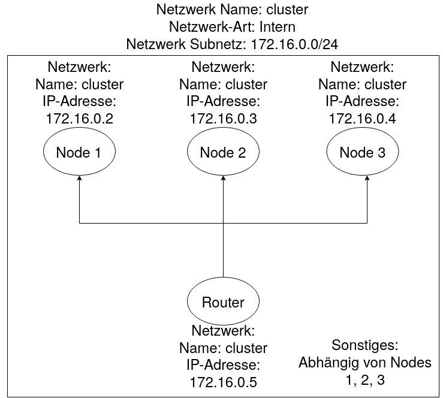
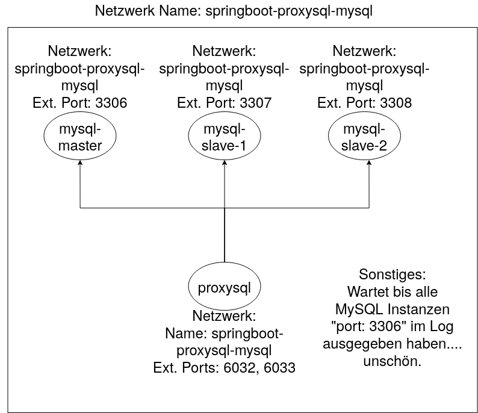
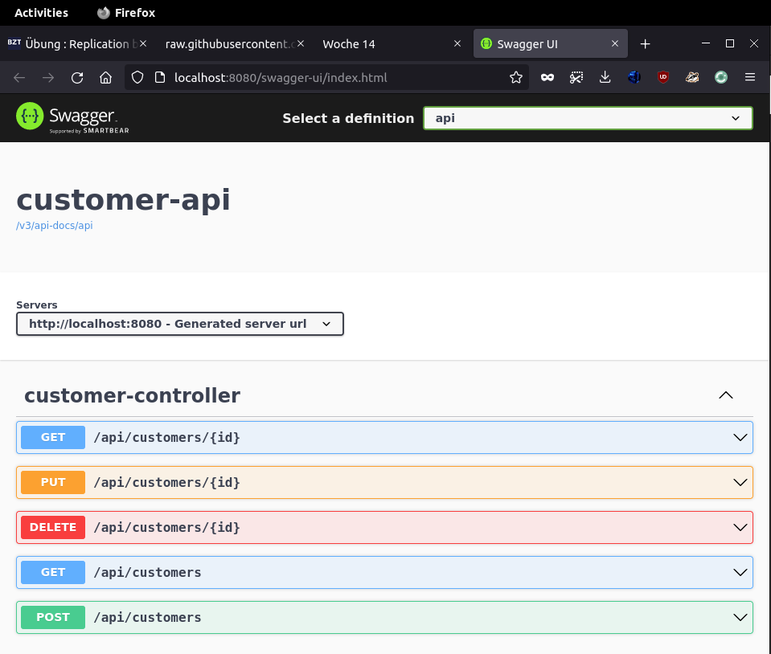

# Replikation bei MySQL

## MySQL-Router

### Auftrag 1

#### Diagramm

Zuerst möchten wir überhaupt wissen, was das docker-compose anstellt und analysieren es hierfür. Ich habe ein Netzwerk-Diagramm gezeichnes, welches aufzeigt wie die Kommunikation zwischen den Services funktioniert:



#### Master Config

Ich werde die Konfigurationen jeweils direkt mittels Kommentaren beschreiben.

```bash
[mysqld]
# Generelle MySQL Einstellungen
server-id = 1 # Einzigartige ID, so können Sie sich identifizieren
port = 3306 # Server-Port

binlog_format = ROW # Das Format für das Binlog, müssen zwischen Replica und Master gleich gehalten werden

gtid_mode=ON
enforce-gtid-consistency=true

log-slave-updates
log_bin = mysql-bin

default_storage_engine = InnoDB # Storage Engine

# Replikationsrelevante Configs

report-host = mysql_node01 # Name vom Master
slave_net_timeout = 60 # 60 Sekunden soll als Timeout gesetzt werden für das verbinden der Replicas

skip-slave-start

transaction_isolation = 'READ-COMMITTED' # Transaktions Level

binlog_checksum = NONE # Wir wollten nicht mittels Checksummen das binlog überprüfen, kostet zusätzliche Ressourcen
relay_log_info_repository = TABLE
transaction_write_set_extraction = XXHASH64

auto_increment_increment = 1
auto_increment_offset = 2

binlog_transaction_dependency_tracking = WRITESET 
slave_parallel_type = LOGICAL_CLOCK
slave_preserve_commit_order = ON
```

#### Replica Config

```bash
[mysqld]
# Generelle MySQL Einstellungen
server-id = 2 # Hier wieder die einzigartige ID
port = 3306 # Server Port

binlog_format = ROW # Gleiches Format für den Binlog wie auf Master

gtid_mode=ON
enforce-gtid-consistency=true

log-slave-updates
log_bin = mysql-bin

default_storage_engine = InnoDB

# Replikationsrelevante Configs

report-host = mysql_node02 # Host als welche sich die Node ausgibt
slave_net_timeout = 60 # hier wieder der Timeout von 60sek

skip-slave-start
read_only

transaction_isolation = 'READ-COMMITTED' # Transaktions Level, gleich wie Master

binlog_checksum = NONE # Wieder keine Checksumme
relay_log_info_repository = TABLE
transaction_write_set_extraction = XXHASH64

auto_increment_increment = 1
auto_increment_offset = 2

binlog_transaction_dependency_tracking = WRITESET
slave_parallel_type = LOGICAL_CLOCK
slave_preserve_commit_order = ON
```

### Auftrag 2

Wir starten die Umgebung mittels ```docker-compose up -d```

Kontrollieren können wir dies mittels ```docker-compose ps && docker-compose logs -f```. So sehen wir ob die Container laufen und in den Logs können wir mögliche Fehler entdecken. 

So sollte das ps Kommando aussehen: 

```bash
[domi@datenbank mysql-innodb-cluster]$ docker-compose ps
               Name                              Command               State                               Ports                            
--------------------------------------------------------------------------------------------------------------------------------------------
mysql-innodb-cluster_mysql_node01_1   docker-entrypoint.sh --def ...   Up      3306/tcp, 33060/tcp, 33061/tcp                               
mysql-innodb-cluster_mysql_node02_1   docker-entrypoint.sh --def ...   Up      3306/tcp, 33060/tcp, 33061/tcp                               
mysql-innodb-cluster_mysql_node03_1   docker-entrypoint.sh --def ...   Up      3306/tcp, 33060/tcp, 33061/tcp                               
mysql-innodb-cluster_router_1         docker-entrypoint.sh mysql ...   Up      0.0.0.0:3306->3306/tcp,:::3306->3306/tcp,                    
0.0.0.0:6446->6446/tcp,:::6446->6446/tcp,                    
0.0.0.0:6447->6447/tcp,:::6447->6447/tcp,                    
0.0.0.0:6606->6606/tcp,:::6606->6606/tcp  
```

### Auftrag 3

Um die Funktionalität zu testen, starten wir eine Bash Shell im node01 Container:

```bash
docker-compose exec mysql_node01 bash
```

Anschliessend loggen wir uns auf MySQL an sich ein mit dem Benutzer root und Passwort root:

```bash
mysqlsh --js root@mysql_node01
```

Zuletzt möchten wir Informationen zum Cluster auslesen:

```js
dba.getCluster().status()
```

Dies generiert folgenden Output, Kommentare beschreiben die einzelnen Dinge:

```js
{
    "clusterName": "testcluster", // Name vom Cluster
    "defaultReplicaSet": {
        "name": "default", // Der Name vom Replikationsset
        "primary": "mysql_node01:3306", // Node 01 ist als master gesetzt
        "ssl": "DISABLED", // SSL macht alles kompliziert, wir machen es aus...
        "status": "OK", // Ist Okay soweit
        "statusText": "Cluster is ONLINE and can tolerate up to ONE failure.", // Statusmeldung
        "topology": { // Hier darunter sieht man die Topologie von 3 Members (minimum)
            "mysql_node01:3306": { // Name:Port
                "address": "mysql_node01:3306", // Adresse:Port
                "memberRole": "PRIMARY", // Primary = Master
                "mode": "R/W", // Read / Write 
                "readReplicas": {}, // Falls man Read Replicas hat...
                "replicationLag": null, // Kein Log der Replikation
                "role": "HA", // Hoch Verfügbarkeits Modus
                "status": "ONLINE", // Node Online?
                "version": "8.0.29" // MySQL Version
            }, 
            "mysql_node02:3306": {
                "address": "mysql_node02:3306", 
                "memberRole": "SECONDARY", // <- Hier darauf achten, nun Secondary, Primary einzigartig
                "mode": "R/O", // Nur Read Only, nur primary kann schreiben
                "readReplicas": {}, 
                "replicationLag": null, 
                "role": "HA", 
                "status": "ONLINE", 
                "version": "8.0.29"
            }, 
            "mysql_node03:3306": {
                "address": "mysql_node03:3306", 
                "memberRole": "SECONDARY", 
                "mode": "R/O", 
                "readReplicas": {}, 
                "replicationLag": null, 
                "role": "HA", 
                "status": "ONLINE", 
                "version": "8.0.29"
            }
        }, 
        "topologyMode": "Single-Primary" // Einzelner Primary
    }, 
    "groupInformationSourceMember": "mysql_node01:3306" // Von hier kommt die Info
}
```

## ProxySQL und Springboot

### Auftrag 1

Zuerst analysieren wir welche dienste aufgebaut werden. Im Auftrag wird beschrieben, dass man das docker-compose analysiere sollte, dies gibt es nun leider nicht mehr. Es wird nun alles mittels docker run gestartet im init-environment.sh Bash script. 

Folgende Dienste werden gestartet:

- myql-master 
- mysql-slave-1
- mysql-slave-2
- proxysql

Dazu habe ich eine Abbildung, inklusive Netzwerk gezeichnet: 



### Auftrag 2

#### Starten der Umgebung 

Innerhalb vom springboot-proxysql-mysql Ordner folgenden Command ausführen:
```
./init-environment.sh
```

Nach dem Start sollten wir am Ende des Outputs sowas sehen:

```
Checking mysql servers
----------------------
hostgroup_id	hostname	port	gtid_port	status	weight	compression	max_connections	max_replication_lag	use_ssl	max_latency_ms	comment
10	mysql-master	3306	0	ONLINE	1	0	100	5	0	0	
20	mysql-slave-1	3306	0	ONLINE	1	0	100	5	0	0	
20	mysql-slave-2	3306	0	ONLINE	1	0	100	5	0	0	

Environment Up and Running
==========================
```

> [!warning]
> Falls bereits Daten in den MySQL Ordnern von einer ehemaligen Native Instanz bestehen, wird der Start fehlschlagen.

#### Überprüfen vom MySQL Replikationsstatus

Hier wieder auch wieder darauf achten, dass man im springboot-proxysql-mysql Ordner ist und anschliessend folgenden Command ausführen:
```
./check-replication-status.sh
```

Der Output sollte etwa folgendem entsprechen (Achtung, ist gekürzt)
```
mysql-master
------------
File	Position	Binlog_Do_DB	Binlog_Ignore_DB	Executed_Gtid_Set
mysql-bin-1.000003	1397			9233ad92-ef08-11ec-a1ab-0242ac140002:1-14

mysql-slave-1
-------------
*************************** 1. row ***************************
               Slave_IO_State: Waiting for master to send event
                  Master_Host: mysql-master
                  Master_User: replication
                  Master_Port: 3306
                Connect_Retry: 60
              Master_Log_File: mysql-bin-1.000003
          Read_Master_Log_Pos: 1397
               Relay_Log_File: e8ff031c69c0-relay-bin.000003
                Relay_Log_Pos: 1614
        Relay_Master_Log_File: mysql-bin-1.000003
             Slave_IO_Running: Yes
            Slave_SQL_Running: Yes
                                ...
```

#### ProxySQL Konfiguration überprüfen

Hier auch wieder im richten Ordner folgenden Command ausführen:
```bash
./proxysql-admin.sh
```

Danach ist man eingeloggt und man kann die MySQL Server mittels folgendem Command anzeigen lassen:
```sql
SELECT * FROM mysql_servers;

-- Output: 
+--------------+---------------+------+-----------+--------+--------+-------------+-----------------+---------------------+---------+----------------+---------+
| hostgroup_id | hostname      | port | gtid_port | status | weight | compression | max_connections | max_replication_lag | use_ssl | max_latency_ms | comment |
+--------------+---------------+------+-----------+--------+--------+-------------+-----------------+---------------------+---------+----------------+---------+
| 10           | mysql-master  | 3306 | 0         | ONLINE | 1      | 0           | 100             | 5                   | 0       | 0              |         |
| 20           | mysql-slave-1 | 3306 | 0         | ONLINE | 1      | 0           | 100             | 5                   | 0       | 0              |         |
| 20           | mysql-slave-2 | 3306 | 0         | ONLINE | 1      | 0           | 100             | 5                   | 0       | 0              |         |
+--------------+---------------+------+-----------+--------+--------+-------------+-----------------+---------------------+---------+----------------+---------+
3 rows in set (0.00 sec)
```

So können wir die globalen Variablen auslesen:
```sql
SELECT * FROM global_variables;

-- Output ist zu gross, sollte aber etwa so aussehen:
+----------------------------------------------------------------------+---------------------------------+
| variable_name                                                        | variable_value                  |
+----------------------------------------------------------------------+---------------------------------+
| mysql-default_charset                                                | utf8                            |
| mysql-default_collation_connection                                   | utf8_general_ci                 |
| mysql-shun_on_failures                                               | 5                               |
| mysql-shun_recovery_time_sec                                         | 10                              |
| mysql-query_retries_on_failure                                       | 1                               |
| mysql-client_multi_statements                                        | true                            |
| mysql-client_host_cache_size                                         | 0                               |
| mysql-client_host_error_counts                                       | 0                               |
...
```

#### Customer API starten

Wieder im Root Ordner folgendes Commando durchführen:
  ```
  ./mvnw clean spring-boot:run --projects customer-api
  ```

Die Website sollte nun unter http://localhost:8080/swagger-ui.html erreichbar sein



#### Simulation

1. Drei Terminals öffnen: Eins für den `mysql-master`, eins für `mysql-slave-1` und eins für `mysql-slave-2`

2. Im `mysql-master` Terminal müssen wir uns auf den MySQL Monitor verbinden:

```bash
docker exec -it -e MYSQL_PWD=secret mysql-master mysql -uroot --database customerdb
```

3. Das gleiche noch für `mysql-slave-1`...

```bash
docker exec -it -e MYSQL_PWD=secret mysql-slave-1 mysql -uroot --database customerdb
```

4. ... und `mysql-slave-2`

```bash
docker exec -it -e MYSQL_PWD=secret mysql-slave-2 mysql -uroot --database customerdb
```

5. In jedem dieser Container müssen wir nun folgende Commands durchführen, um Logs einzuschalten:

```sql
SET GLOBAL general_log = 'ON';
SET global log_output = 'table';
```

6. Nun öffnen wir ein weiteres Terminal, in diesem Fenster werden wir mit dem Curl Commando arbeiten um af die API zuzugreifen:

7. Im Curl Fenster möchten wir nun unseren ersten Customer erstellen:

```bash
curl -i -X POST http://localhost:8080/api/customers \
-H 'Content-Type: application/json' \
-d '{"firstName": "Ivan", "lastName": "Franchin"}'
```

Output: 

```js
HTTP/1.1 201 
Content-Type: application/json
Transfer-Encoding: chunked
Date: Sat, 18 Jun 2022 13:35:55 GMT

{"id":1,"firstName":"Ivan","lastName":"Franchin"}
```

8. Jetzt können wir im MySQL Master Terminal folgenden Command ausführen:

```
SELECT event_time, command_type, SUBSTRING(argument,1,250) argument FROM mysql.general_log
WHERE command_type = 'Query' AND (argument LIKE 'insert into customers %' OR argument LIKE 'select customer0_.id %' OR argument LIKE 'update customers %' OR argument LIKE 'delete from customers %');
```

Output:

```sql
+----------------------------+--------------+-------------------------------------------------------------------------------------------------------------------------------------------------+
| event_time                 | command_type | argument                                                                                                                                        |
+----------------------------+--------------+-------------------------------------------------------------------------------------------------------------------------------------------------+
| 2022-06-18 13:35:55.550258 | Query        | insert into customers (created_at, first_name, last_name, updated_at) values ('2022-06-18 13:35:55', 'Ivan', 'Franchin', '2022-06-18 13:35:55') |
+----------------------------+--------------+-------------------------------------------------------------------------------------------------------------------------------------------------+
1 row in set (0.00 sec)
```

>[!note] Falls man den gleichen `SELECT` Command auf einem Slave ausführt wird man bemerken das nur der Master den Insert durchgeführt hat. Wichtig: Nur der Master kann inserts, updates oder deletes durchführen.

9. Nun möchten wir über GET den customer 1 via Curl herausfinden, hierfür folgenden Command im Curl Terminal eingeben:

```bash
curl -i http://localhost:8080/api/customers/1
```

Output:

```js
HTTP/1.1 200 
Content-Type: application/json
Transfer-Encoding: chunked
Date: Sat, 18 Jun 2022 13:41:25 GMT

{"id":1,"firstName":"Ivan","lastName":"Franchin"}
```

10. Mittels folgendem `SELECT` auf einem Slave um unsere Query von vorher auf dem Slave zu sehen:

```sql
SELECT event_time, command_type, SUBSTRING(argument,1,250) argument FROM mysql.general_log
WHERE command_type = 'Query' AND (argument LIKE 'insert into customers %' OR argument LIKE 'select customer0_.id %' OR argument LIKE 'update customers %' OR argument LIKE 'delete from customers %');
```

Output:

```sql
+----------------------------+--------------+-----------------------------------------------------------------------------------------------------------------------------------------------------------------------------------------------------------------------------------------------------+
| event_time                 | command_type | argument                                                                                                                                                                                                                                            |
+----------------------------+--------------+-----------------------------------------------------------------------------------------------------------------------------------------------------------------------------------------------------------------------------------------------------+
| 2022-06-18 13:41:25.985738 | Query        | select customer0_.id as id1_0_0_, customer0_.created_at as created_2_0_0_, customer0_.first_name as first_na3_0_0_, customer0_.last_name as last_nam4_0_0_, customer0_.updated_at as updated_5_0_0_ from customers customer0_ where customer0_.id=1 |
+----------------------------+--------------+-----------------------------------------------------------------------------------------------------------------------------------------------------------------------------------------------------------------------------------------------------+
1 row in set (0.00 sec)
```

>[!note] Dies sollte nur auf einem der Slaves funktionieren, da nur ein Slave die Query zurückgegeben hat. Man muss also beide probieren, falls es beim ersten empty set zurückgibt. 

11. Als nächstes möchten wir den customer 1 mittels dem `UPDATE` Command verändern mittels Curl: 

```bash
curl -i -X PUT http://localhost:8080/api/customers/1 \
-H 'Content-Type: application/json' \
-d '{"firstName": "Ivan2", "lastName": "Franchin2"}'
```

Output:

```js
HTTP/1.1 200 
Content-Type: application/json
Transfer-Encoding: chunked
Date: Sat, 18 Jun 2022 13:47:21 GMT

{"id":1,"firstName":"Ivan2","lastName":"Franchin2"}
```

12. Nun, wenn wir folgenden `SELECT` im Master Container ausführen, sollten wir wieder das Update und den Insert sehen:

```
SELECT event_time, command_type, SUBSTRING(argument,1,250) argument FROM mysql.general_log
WHERE command_type = 'Query' AND (argument LIKE 'insert into customers %' OR argument LIKE 'select customer0_.id %' OR argument LIKE 'update customers %' OR argument LIKE 'delete from customers %');
```

Output:

```sql
+----------------------------+--------------+-------------------------------------------------------------------------------------------------------------------------------------------------+
| event_time                 | command_type | argument                                                                                                                                        |
+----------------------------+--------------+-------------------------------------------------------------------------------------------------------------------------------------------------+
| 2022-06-18 13:35:55.550258 | Query        | insert into customers (created_at, first_name, last_name, updated_at) values ('2022-06-18 13:35:55', 'Ivan', 'Franchin', '2022-06-18 13:35:55') |
| 2022-06-18 13:47:21.442020 | Query        | update customers set created_at='2022-06-18 13:35:55', first_name='Ivan2', last_name='Franchin2', updated_at='2022-06-18 13:47:21' where id=1   |
+----------------------------+--------------+-------------------------------------------------------------------------------------------------------------------------------------------------+
2 rows in set (0.00 sec)
```

13. Zuletzt löschen wir den Customer 1 wieder mittels `DELETE` und Curl:

```bash
curl -i -X DELETE http://localhost:8080/api/customers/1
```

Output:

```js
HTTP/1.1 200 
Content-Type: application/json
Transfer-Encoding: chunked
Date: Sat, 18 Jun 2022 13:51:06 GMT

{"id":1,"firstName":"Ivan2","lastName":"Franchin2"}
```

14. Hier nochmals der alt bekannte `SELECT` auf dem Master, den `DELETE` sollten wir nun ebenfalls sehen:

```
SELECT event_time, command_type, SUBSTRING(argument,1,250) argument FROM mysql.general_log
WHERE command_type = 'Query' AND (argument LIKE 'insert into customers %' OR argument LIKE 'select customer0_.id %' OR argument LIKE 'update customers %' OR argument LIKE 'delete from customers %');
```

Output:

```sql
+----------------------------+--------------+-------------------------------------------------------------------------------------------------------------------------------------------------+
| event_time                 | command_type | argument                                                                                                                                        |
+----------------------------+--------------+-------------------------------------------------------------------------------------------------------------------------------------------------+
| 2022-06-18 13:35:55.550258 | Query        | insert into customers (created_at, first_name, last_name, updated_at) values ('2022-06-18 13:35:55', 'Ivan', 'Franchin', '2022-06-18 13:35:55') |
| 2022-06-18 13:47:21.442020 | Query        | update customers set created_at='2022-06-18 13:35:55', first_name='Ivan2', last_name='Franchin2', updated_at='2022-06-18 13:47:21' where id=1   |
| 2022-06-18 13:51:06.073579 | Query        | delete from customers where id=1                                                                                                                |
+----------------------------+--------------+-------------------------------------------------------------------------------------------------------------------------------------------------+
3 rows in set (0.00 sec)
```

#### Herunterfahren vom Cluster

Um die customer-api Applikation zu stoppen einfach ctrl+c verwenden.

Um den ganzen Softwarestack herunterzufahren im Root Terminal folgenden Command eingeben:

```bash
./shutdown-environment.sh
```

Output:

```bash
[domi@desk springboot-proxysql-mysql]$ ./shutdown-environment.sh

Starting the environment shutdown
=================================

Removing containers
-------------------
mysql-master
mysql-slave-1
mysql-slave-2
proxysql

Removing network
----------------
springboot-proxysql-mysql

Environment shutdown successfully
=================================
```